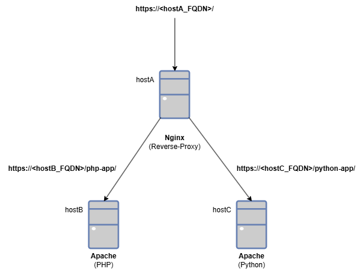

# ansbile-playbooks-web-infra
Ansible playbooks for creating a multi-tiered web-hosting infrastructure.

## Overview
I have developed a series of Ansible playbooks to build web-hosting infrastructure comprising [Nginx](https://https://nginx.org) reverse-proxying to backend [Apaches](https://httpd.apache.org/) running PHP and Python-based applications.



This project is primarily an investigation into the capabilities of Ansible automation and what can be achieved with Ansible playbooks in building web infrastructure using best-practices, etc.

### High-level Design

- [Nginx](https://https://nginx.org) was chosen for the front-end as it is currently considered to be one of the best industry-standard reverse-proxies.
- The backend comprises [Apaches](https://httpd.apache.org/) having modules installed and configured to serve PHP or Python-based dynamic content.  
- For both the Nginx instance and the Apache instances, name-based virtual hosting is used as this is considered best practice.
- The "Document Root" for the web servers is relocated from the defaults to `/srv/www` (the traditional filesystem intended for web serving) and SELinux changes are made allow for this.  SELinux changes are also implemented to support reverse-proxying.
- The Nginx and Apache instances can also serve static content if desired (the playbooks have tagged tasks to allow for content to be added from a Git repo).
- Strictly-speaking the Apaches could have been omitted from this infrastructure and backend stand-alone application servers, such as PHP-FPM and Gunicorn, used instead but this was not the challenge here.  
- The Apache playbooks were also deliberately designed to allow for stand-alone installations of e.g. Apache/PHP-FPM and Apache/Python for additional deployment options, (if you wanted to install such instances outside of a reverse-proxy infrastructure say).
- The playbooks are configured to run on Red Hat Enterprise Linux (RHEL) based systems, but could be adapted for other Linux distributions if required.  (The playbooks have been verified as working on Alma Linux 9).

### Project Structure
```
ansbile-playbooks-web-infra/
├── files/
│   ├── conf_httpd/
│   ├── conf_nginx/
│   └── ssl/
├── inventory/
│   └── inventory.yml
├── playbook-apache.yml
├── playbook-master.yml
├── playbook-nginx-rp.yml
├── playbook-php-fpm-8.2.yml
├── playbook-python-mod_wsgi.yml
├── roles/
│   ├── apache/
│   └── nginx/
└── secrets.yml
```

- The `files/conf_*/` directories holds Nginx and Apache `.conf` files or `.j2` Jinja2 template files for creating custom `.conf` files.
- The `ssl/` directory is where pre-prepared SSL/TLS certificates and key files for the Nginx and Apache instances need to be copied to prior to running the playbooks.
- Files named `playbook-*.yml` are the Ansible playbooks for installing and configuring Nginx and Apache infrastructure.  Some of these playbooks use Ansible [roles](https://docs.ansible.com/projects/ansible/latest/playbook_guide/playbooks_reuse_roles.html) defined under the `roles/` subdirectory.
- The `secrets.yml` file holds Git repo authentication details that is used by some of the playbooks (such as `playbook-nginx-rp.yml`).  This file needs to encrypted using `ansible-vault` after editing.

#### The Ansible Playbooks & Roles
- `playbook-apache.yml` - installs and configures Apache with a virtual host based on the host server's FQDN.  Static web content is downloaded from a Git repo using an SSH public key, but tasks that do this are tagged, so can be omitted if desired.  The playbook uses a custom-made Ansible role `roles/apache` to install a base Apache installation.
- `playbook-php-fpm-8.2.yml` - installs PHP-FPM on a particular `web_backend` Apache host, creates a test PHP page, and then verifies it.
- `playbook-python-mod_wsgi.yml` - installs `mod_wsgi` on a particular `web_backend` Apache host, creates a test Python page, and then verifies it.
- `playbook-nginx-rp.yml` - installs Nginx as a front-end proxy.  Static web content is downloaded from a Git repo using a Git access token, but tasks that do this are tagged, so can be omitted if desired.  The Git repo access token details must be place in `secrets.yml` and encrypted using `ansible-vault`.  Consequently, this playbook must be given the password for the vault at run-time.
- `playbook-master.yml` - this playbook runs all the above in the required order.

Some of the above playbooks use the following custom roles that I've created specifically for this project:
- `roles/apache` - installs a base installation of [Apache 2.4 HTTP Server](https://httpd.apache.org/docs/2.4/) and verifies the installation.
- `roles/apache` - installs a base installation of [Nginx 1.24](https://nginx.org/en/CHANGES-1.24) and verifies the installation.  (For this role, you can change the version installed by editing the `roles/nginx/vars/main.yml` file's `nginx_version_install` variable, provided the version is supported on your O.S. platform).


#### Then Ansible Inventory file
The `inventory/inventory.yml` file is an Ansible inventory files showing with the required host groups and variables expected by the playbooks as shown below:
```
allhosts:
  children:
    web_frontend:
    web_backend:
  vars:
    remote_user: ansible

web_frontend:
  children:
    web_reverse_proxy:
  vars:
    # git_repo: <<NOT_USED>> 

web_backend:
  children:
    web_php:
    web_python:
  vars:
    git_repo: <<REPLACE_WITH_YOUR_GIT_REPO_URL>>


web_reverse_proxy:
  hosts:
    <<hostA>>:
      ansible_host: <<hostA_FQDN>>
      site_ssl_crt: <<hostA.crt>>
      site_ssl_key: <<hostA.key>>

web_php:
  hosts:
    <<hostB>>:
      ansible_host: <<hostB_FQDN>>
      site_ssl_crt: <<hostB.crt>>
      site_ssl_key: <<hostB.key>>
      php_app_uri: php-app

web_python:
  hosts:
    <<hostC>>:
      ansible_host: <<hostC_FQDN>>
      site_ssl_crt: <<hostC.crt>>
      site_ssl_key: <<hostC.key>>
      python_app_uri: python-app
```
The items marked `<< >>` in this file need to be updated with short hostnames, FQDNs, and the SSL certs and keys, Git repo URLs, etc, for each of the hosts before use.

## Prerequisites
The files in this repo are ready for use, but bear in mind this is a development project not intended for production use.  To run the installation you'll first need:

- [x] Ansible infrastructure (Control Node, etc), with the ability to run privileged-level operations (e.g with `sudo`) across the Managed Nodes.

- [x] At least three Ansible Managed Nodes running RHEL-based O.S. (preferably RHELv8 or v9).  Network connectivity between the Nginx node and backend Apache nodes should be allowed over ports TCP/80 and TCP/443.

- [x] [FQDNs](https://en.wikipedia.org/wiki/Fully_qualified_domain_name) for each of the Managed Nodes that is resolvable by the others (either using a corporate DNS Server or using hosts files).  The FQDNs will be used in the name-based virtual hosting configurations of each of the servers.

- [x] SSL/TLS certificates for each Managed Nodes corresponding to its FQDN.  The certificates and key files should be copied into the project's `files/ssl` directory.

- [x] Access to a Git repository holding your static and/or dynamic content.  The playbooks use GitLab with access either by using an access token or an SSH public key, but this can be changed if required.

- [x] If downloading content from a Git repo using an SSH public key, the corresponding public key must exist on the host machine for the Ansible user (e.g. `~/.ssh/id_ed25519`).  Only the Apache web content is retrieved using this method.

- [x] If downloading content from a Git repo using an access token and the `secrets.yml` file must be updated first with the relevant details before being encrypted using `ansible-vault`.

- [x] Update the `inventory/inventory.yml` file with the required hostnames, FQDNs, and other variable values mentioned above.

## Running the Playbooks
Once the prequisites have been met, the project can be copied to the Ansible Control machine and the playbooks executed in the following order using the `ansible-playbook <playbook_name>` command:

1. `playbook-apache.yml`
2. `playbook-php-fpm-8.2.yml` and `playbook-python-mod_wsgi.yml`.
3. `playbook-nginx-rp.yml`.  (You need to use `ansible-playbook --ask-pass ....` for this playbook if you've configured `secrets.yml` as an Ansible Vault).

Alternatively, you can just run `playbook-master.yml` to run all the above in one go.

If desired, you can also run the playbooks selectively to create stand-alone web server hosting instances as follows:

- If you just wanted an Apache web server that only serves static content, just run `playbook-apache.yml`.
- If you just wanted an Apache web server that also serves PHP, run `playbook-apache.yml` followed by `playbook-php-fpm-8.2.yml`..
- If you just wanted an Apache web server that also serves Python content (e.g. Django, Flask), run `playbook-apache.yml` followed by `playbook-python-mod_wsgi.yml`.


### TO-DO:
This is a exploratory development project that can benefit from some improvements and enhancements, such as:

- Scale the playbooks to create a large web serving farm with multiple front ends more diverse backends.

- Create additional Ansible role e.g. `common` for performing common configurations needed across all hosts.

- Improve some of the playbook configured tasks for idempotency.

- For improved automation, Ansible could also be used for SSL certificate generation.  Although, this is not currently implemented widely in enterprise environments.